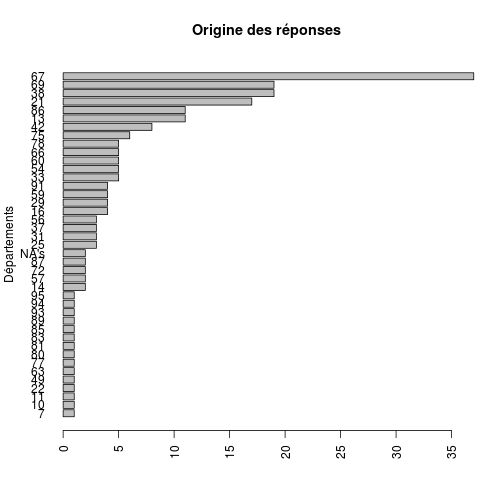

Questionnaire IFA
========================================================

```{}
file="f.csv"
d<-read.csv(file,header=TRUE,skip=1,sep=";")

d$diplÃ.me<-d$diplome
d$cohÃ.rence<-d$coherence
d$quand.j.estime.que.ca.le.merite<-d$estime

names(d)
str(d)
save(d,file="data.Rda")
```

```r
load("data.Rda")

attach(d)
dept <- as.factor(dept)
s <- summary(dept)
barplot(sort(s), horiz = T, las = 2, main = "Origine des réponses", ylab = "Départements")
```

 

```r

summary(activite)
```

```
##                                 ASSU       ASSU, Ambulance de catégorie C 
##                                   10                                    9 
##             Ambulance de catégorie C                           VSL,  ASSU 
##                                   19                                   20 
## VSL,  ASSU, Ambulance de catégorie C        VSL, Ambulance de catégorie C 
##                                  114                                   34
```

```r

summary(Zone)
```

```
##            Zone rurale Zone rurale et urbaine           Zone urbaine 
##                     35                    141                     30
```

```r

summary(ADE)
```

```
##    Min. 1st Qu.  Median    Mean 3rd Qu.    Max.    NA's 
##     1.0     5.0     9.0    13.4    16.0   140.0       1
```

```r

summary(Aux)
```

```
##    Min. 1st Qu.  Median    Mean 3rd Qu.    Max.    NA's 
##    0.00    2.00    5.00    8.63   10.00   70.00       1
```

Lecteurs de glycémie

```r
summary(lecteur)
```

```
##                           Non            Oui Tous les jours 
##              1             65            139              1
```

```r
round(prop.table(l) * 100, 2)
```

```
## Error: objet 'l' introuvable
```

```r
table(activite, lecteur)
```

```
##                                       lecteur
## activite                                  Non Oui Tous les jours
##    ASSU                                 0   2   8              0
##    ASSU, Ambulance de catégorie C       0   4   5              0
##   Ambulance de catégorie C              0  15   4              0
##   VSL,  ASSU                            1   4  15              0
##   VSL,  ASSU, Ambulance de catégorie C  0  20  93              1
##   VSL, Ambulance de catégorie C         0  20  14              0
```

```r

table(activite, ecg)
```

```
##                                       ecg
## activite                                  Non Oui
##    ASSU                                 0   6   4
##    ASSU, Ambulance de catégorie C       0   7   2
##   Ambulance de catégorie C              0  19   0
##   VSL,  ASSU                            0  16   4
##   VSL,  ASSU, Ambulance de catégorie C  2  91  21
##   VSL, Ambulance de catégorie C         0  34   0
```


