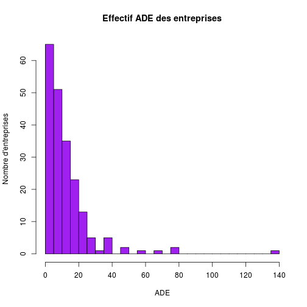

Questionnaire IFA
========================================================


```r
file = "f.csv"
d <- read.csv(file, header = TRUE, skip = 1, sep = ";")

d$diplÃ.me <- d$diplome
d$cohÃ.rence <- d$coherence
d$quand.j.estime.que.ca.le.merite <- d$estime

attach(d)

a <- as.character(activite)
a[a == " ASSU"] <- "A"
a[a == "Ambulance de catégorie C"] <- "C"
a[a == "VSL,  ASSU"] <- "VA"
a[a == "VSL,  ASSU, Ambulance de catégorie C"] <- "VAC"
a[a == "VSL, Ambulance de catégorie C"] <- "VC"
a[a == " ASSU, Ambulance de catégorie C"] <- "AC"
activite <- as.factor(a)
summary(activite)
```

```
##   A  AC   C  VA VAC  VC 
##  10   9  19  20 114  34
```

```r
plot(activite, main = "Activité des entreprises de transport sanitaire", xlab = "A = ASSU, C = Cat.C, V = VSL", 
    ylab = "Nombre")
```

 

```r


names(d)
```

```
##  [1] "date"           "diplôme"        "dept"           "activite"      
##  [5] "Zone"           "ADE"            "Aux"            "tenues"        
##  [9] "T2"             "couleur"        "protocole"      "observance"    
## [13] "cohérence"      "rythme"         "frequence"      "lecteur"       
## [17] "L2"             "L3"             "prescripteur"   "ecg"           
## [21] "ecg1"           "ecg2"           "aspirations"    "asp1"          
## [25] "asp2"           "immobilisation" "conducteur"     "cond2"         
## [29] "vvp"            "vvp2"           "lettre"         "admission"     
## [33] "Admission.1"    "Admission.2"    "X"              "X.1"           
## [37] "X.2"            "X.3"            "X.4"            "Transfert"     
## [41] "X.5"            "X.6"
```

```r
str(d)
```

```
## 'data.frame':	206 obs. of  42 variables:
##  $ date          : Factor w/ 201 levels "04/10/2013 14:35",..: 1 2 3 4 5 6 6 7 8 9 ...
##  $ diplôme       : int  2013 2011 2011 2011 2013 2008 2012 2012 2012 2013 ...
##  $ dept          : int  67 67 67 67 38 67 67 38 67 21 ...
##  $ activite      : Factor w/ 6 levels "Ambulance de catégorie C",..: 5 6 1 6 4 1 1 3 3 6 ...
##  $ Zone          : Factor w/ 3 levels "Zone rurale",..: 2 2 2 2 1 2 3 2 2 3 ...
##  $ ADE           : int  7 17 3 25 4 2 2 3 7 20 ...
##  $ Aux           : int  0 25 2 30 3 2 2 0 3 5 ...
##  $ tenues        : Factor w/ 2 levels "Non","Oui": 2 2 2 2 2 2 2 2 2 2 ...
##  $ T2            : Factor w/ 3 levels "","Non","Oui": 3 3 3 3 2 3 3 3 3 3 ...
##  $ couleur       : Factor w/ 91 levels "bas blanc et haut bleu",..: 22 10 71 28 48 54 78 50 58 46 ...
##  $ protocole     : Factor w/ 2 levels "Non","Oui": 2 2 2 2 2 2 2 2 2 2 ...
##  $ observance    : Factor w/ 4 levels "","Jamais","Parfois",..: 4 4 4 4 4 4 3 4 4 3 ...
##  $ cohérence     : Factor w/ 3 levels "","Non","Oui": 3 2 3 3 3 3 3 3 3 3 ...
##  $ rythme        : Factor w/ 3 levels "Non"," obligation d'hygiène mais sans protocole.",..: 3 3 3 3 3 3 1 3 3 1 ...
##  $ frequence     : Factor w/ 7 levels "Non","Tous les jours",..: 6 6 2 4 6 2 2 5 4 2 ...
##  $ lecteur       : Factor w/ 4 levels "","Non","Oui",..: 1 3 3 3 3 2 2 3 3 3 ...
##  $ L2            : Factor w/ 2 levels "Non","Oui": 1 1 2 2 2 2 2 2 2 1 ...
##  $ L3            : Factor w/ 2 levels "Non","Oui": 2 2 2 2 1 1 1 1 2 2 ...
##  $ prescripteur  : Factor w/ 8 levels "","De façon spontanée dans certaines situations ",..: 2 3 7 8 1 1 1 1 2 2 ...
##  $ ecg           : Factor w/ 3 levels "","Non","Oui": 3 2 2 3 2 2 2 2 2 2 ...
##  $ ecg1          : Factor w/ 4 levels "","Non","Oui de manière autonome",..: 3 1 1 4 1 1 1 1 2 2 ...
##  $ ecg2          : Factor w/ 3 levels "","Non","Oui": 2 2 3 3 2 3 2 2 2 2 ...
##  $ aspirations   : Factor w/ 2 levels "Non","Oui": 2 2 2 2 2 2 1 2 1 2 ...
##  $ asp1          : Factor w/ 2 levels "Non","Oui": 1 2 2 1 1 2 1 2 1 2 ...
##  $ asp2          : Factor w/ 2 levels "Non","Oui": 1 1 1 1 2 1 1 1 1 2 ...
##  $ immobilisation: Factor w/ 4 levels "Matelas immobilisateur à dépression : matelas coquille",..: 1 1 1 2 1 1 1 1 1 1 ...
##  $ conducteur    : Factor w/ 6 levels "","Jamais","Matelas immobilisateur à dépression : matelas coquille, Planche à immobilisation type : Baxtrap ",..: 2 5 6 6 5 5 5 5 5 5 ...
##  $ cond2         : Factor w/ 5 levels "","Jamais","Matelas immobilisateur à dépression : matelas coquille",..: 2 5 1 5 1 5 1 4 5 5 ...
##  $ vvp           : Factor w/ 3 levels "Non","Oui","Parfois": 2 1 1 2 1 2 1 1 1 1 ...
##  $ vvp2          : Factor w/ 19 levels "","....","A APPRENDRE",..: 18 1 1 19 1 19 1 1 1 1 ...
##  $ lettre        : Factor w/ 20 levels "","ca depend ce qui manque",..: 20 20 12 11 20 20 20 20 20 20 ...
##  $ admission     : Factor w/ 4 levels "","Non","Oui",..: 2 3 3 3 3 3 3 3 3 3 ...
##  $ Admission.1   : Factor w/ 6 levels "","En situation d'entrée programmée",..: 1 3 3 1 3 3 3 3 5 3 ...
##  $ Admission.2   : Factor w/ 5 levels "Jamais","Les deux ",..: 1 1 1 4 4 4 1 4 4 4 ...
##  $ X             : Factor w/ 3 levels "","Les deux ",..: 1 1 1 1 1 1 1 1 1 1 ...
##  $ X.1           : Factor w/ 2 levels "","Parfois": 1 1 1 1 1 1 1 1 1 1 ...
##  $ X.2           : logi  NA NA NA NA NA NA ...
##  $ X.3           : logi  NA NA NA NA NA NA ...
##  $ X.4           : logi  NA NA NA NA NA NA ...
##  $ Transfert     : Factor w/ 3 levels "","Non","Oui": 3 3 3 2 3 2 2 3 2 2 ...
##  $ X.5           : Factor w/ 28 levels "","amie IDE",..: 27 25 28 1 6 1 1 28 1 3 ...
##  $ X.6           : Factor w/ 2 levels "","Non": 1 1 1 1 1 1 1 1 1 1 ...
```

```r
save(d, file = "data.Rda")
```


```r
load("data.Rda")

attach(d)
```

```
## L'objet suivant est masqué _by_ .GlobalEnv:
## 
##     activite
## Les objets suivants sont masqués from d (position 3):
## 
##     activite, ADE, admission, Admission.1, Admission.2, asp1,
##     asp2, aspirations, Aux, cohérence, cond2, conducteur, couleur,
##     date, dept, diplôme, ecg, ecg1, ecg2, frequence,
##     immobilisation, L2, L3, lecteur, lettre, observance,
##     prescripteur, protocole, rythme, T2, tenues, Transfert, vvp,
##     vvp2, X, X.1, X.2, X.3, X.4, X.5, X.6, Zone
```

```r
dept <- as.factor(dept)
s <- summary(dept)
barplot(sort(s), horiz = T, las = 2, main = "Origine des réponses", ylab = "Départements")
```

 

```r

summary(activite)
```

```
##   A  AC   C  VA VAC  VC 
##  10   9  19  20 114  34
```

```r

print("Lieux d'exercice")
```

```
## [1] "Lieux d'exercice"
```

```r
summary(Zone)
```

```
##            Zone rurale Zone rurale et urbaine           Zone urbaine 
##                     35                    141                     30
```

```r
print("Lieux d'exercice en %")
```

```
## [1] "Lieux d'exercice en %"
```

```r
round(prop.table(table(Zone)) * 100, 2)
```

```
## Zone
##            Zone rurale Zone rurale et urbaine           Zone urbaine 
##                  16.99                  68.45                  14.56
```

```r

summary(ADE)
```

```
##    Min. 1st Qu.  Median    Mean 3rd Qu.    Max.    NA's 
##     1.0     5.0     9.0    13.4    16.0   140.0       1
```

```r
hist(ADE, breaks = 30, main = "Effectif ADE des entreprises", ylab = "Nombre d'entreprises", 
    col = "purple")
```

 

```r

summary(Aux)
```

```
##    Min. 1st Qu.  Median    Mean 3rd Qu.    Max.    NA's 
##    0.00    2.00    5.00    8.63   10.00   70.00       1
```

```r
hist(Aux, breaks = 30, main = "Effectif Auxiliaires des entreprises", ylab = "Nombre d'entreprises", 
    xlab = "effectif", col = "pink")
```

 

Lecteurs de glycémie

```r
l <- summary(lecteur)
round(prop.table(l) * 100, 2)
```

```
##                           Non            Oui Tous les jours 
##           0.49          31.55          67.48           0.49
```

```r
print("Avez-vous été formé au lecteur ?")
```

```
## [1] "Avez-vous été formé au lecteur ?"
```

```r
summary(L2)
```

```
## Non Oui 
##  75 131
```

```r
print("en %")
```

```
## [1] "en %"
```

```r
round(prop.table(summary(L2)) * 100, 2)
```

```
##   Non   Oui 
## 36.41 63.59
```

```r
print("Département et formation au lecteur glycémie:")
```

```
## [1] "Département et formation au lecteur glycémie:"
```

```r
table(dept, L2)
```

```
##     L2
## dept Non Oui
##   7    1   0
##   10   1   0
##   11   0   1
##   13   6   5
##   14   2   0
##   16   0   4
##   21  14   3
##   22   1   0
##   25   2   1
##   29   1   3
##   31   2   1
##   33   3   2
##   37   2   1
##   38   2  17
##   42   1   7
##   49   0   1
##   54   3   2
##   56   0   3
##   57   1   1
##   59   3   1
##   60   3   2
##   63   0   1
##   66   1   4
##   67   4  33
##   69   5  14
##   72   1   1
##   75   2   4
##   77   1   0
##   78   3   2
##   80   0   1
##   81   0   1
##   83   1   0
##   85   0   1
##   86   2   9
##   87   1   1
##   89   1   0
##   91   2   2
##   93   0   1
##   94   1   0
##   95   1   0
```

```r
print("Le 67 est sur-représenté")
```

```
## [1] "Le 67 est sur-représenté"
```

```r
table(activite, lecteur)
```

```
##         lecteur
## activite    Non Oui Tous les jours
##      A    0   2   8              0
##      AC   0   4   5              0
##      C    0  15   4              0
##      VA   1   4  15              0
##      VAC  0  20  93              1
##      VC   0  20  14              0
```

```r
print("L'utilisez-vous ?")
```

```
## [1] "L'utilisez-vous ?"
```

```r
summary(L3)
```

```
## Non Oui 
##  89 117
```

```r
print("Formation et utilisation:")
```

```
## [1] "Formation et utilisation:"
```

```r
table(L2, L3)
```

```
##      L3
## L2    Non Oui
##   Non  31  44
##   Oui  58  73
```

```r
print("La majorité des utilisateurs ont été formés à l'utilisation")
```

```
## [1] "La majorité des utilisateurs ont été formés à l'utilisation"
```

```r


table(activite, ecg)
```

```
##         ecg
## activite    Non Oui
##      A    0   6   4
##      AC   0   7   2
##      C    0  19   0
##      VA   0  16   4
##      VAC  2  91  21
##      VC   0  34   0
```


